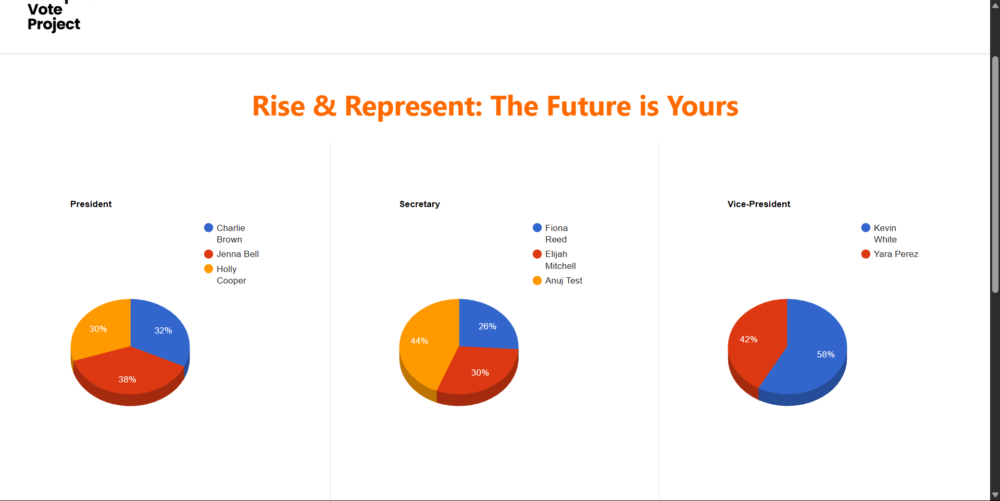
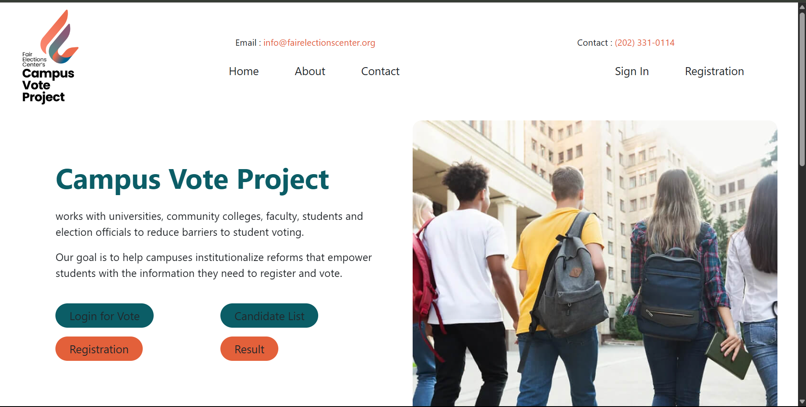
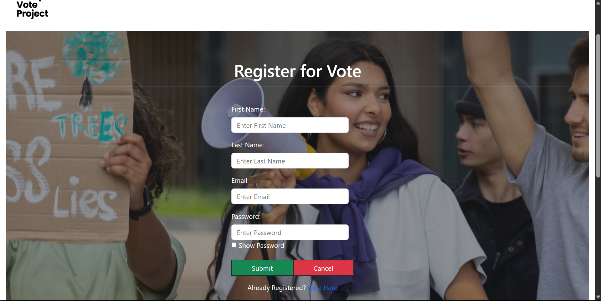
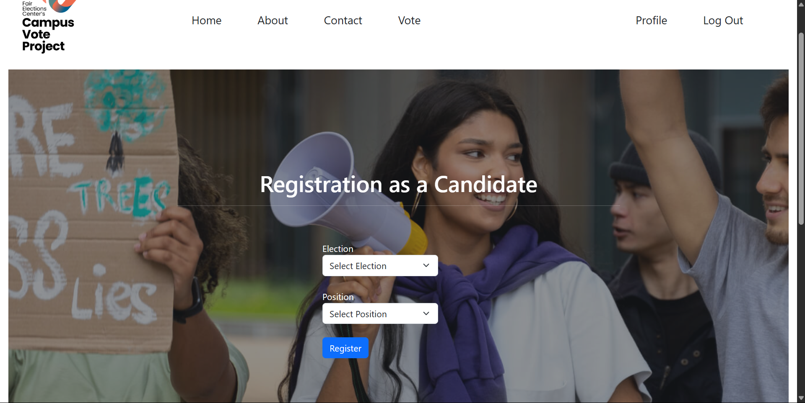
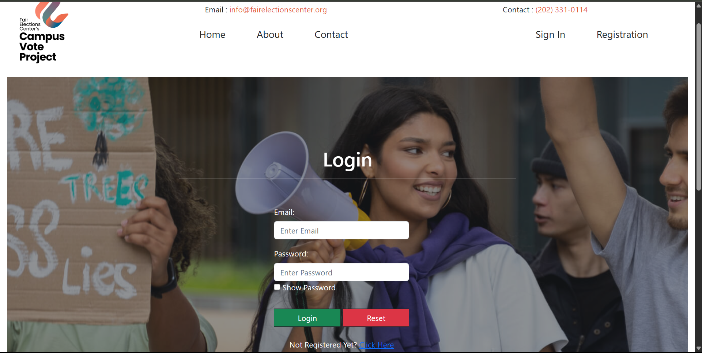
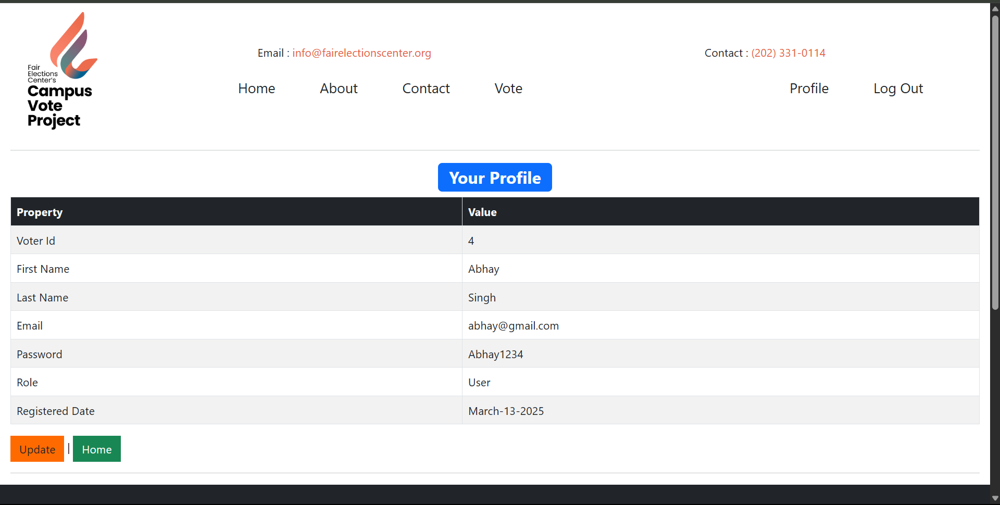
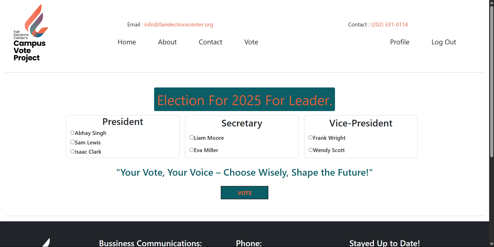
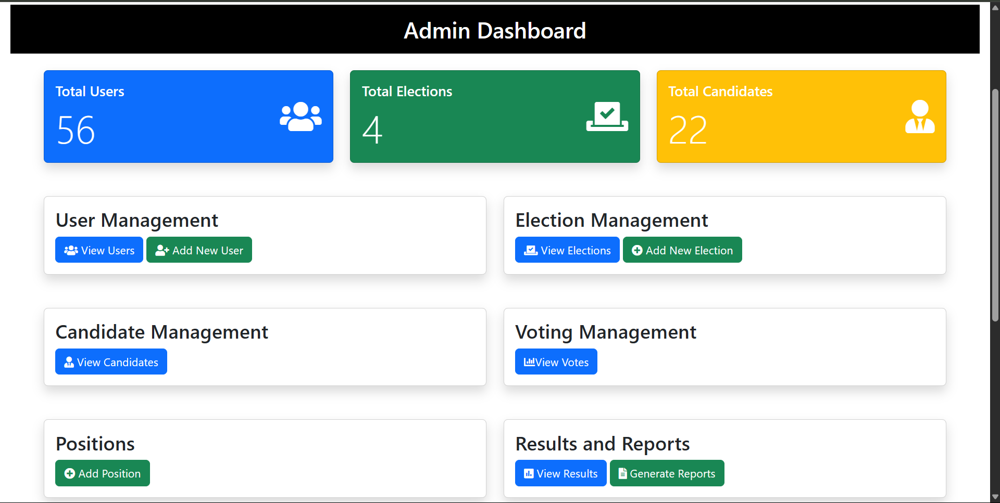
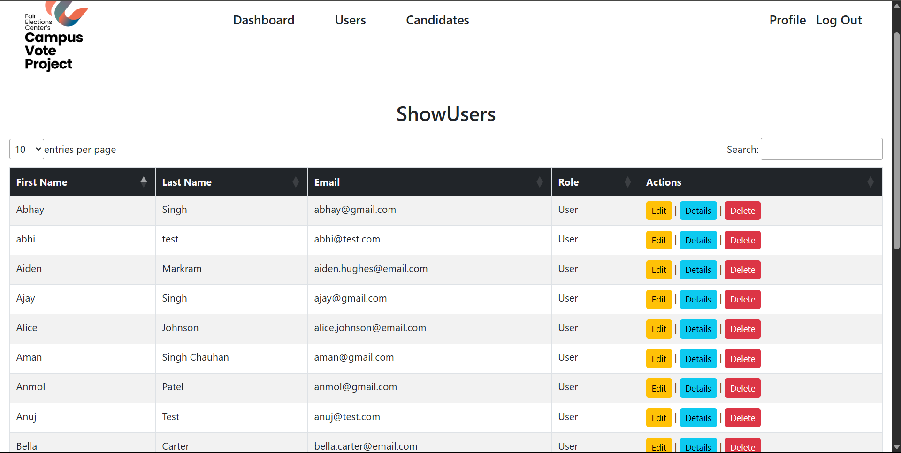
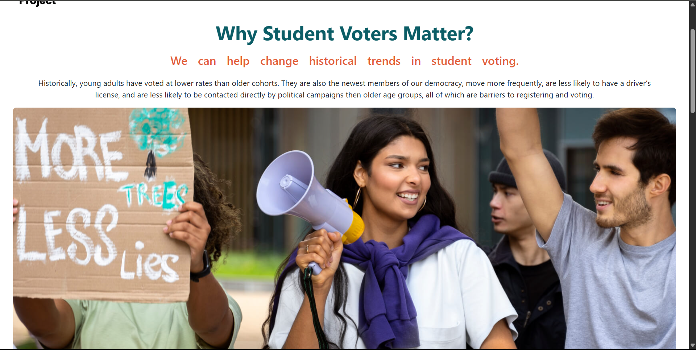

# 🗳️ College Voting Management System

## 📌 Project Overview

The **College Voting Management System** is a secure and efficient web application built using **ASP.NET MVC**, **Entity Framework** with **Code first Approach**, designed to facilitate digital elections within a college or academic institution. It allows students to vote online for various posts like president, secretary, etc., and displays real-time election statistics using **Google Charts**.

---

## 🎯 Key Features

- 🧑‍🎓 Student Registration and Login
- 🗳️ Cast Vote Functionality (One vote per user)
- 👥 Candidate Management (Add, Edit, Delete)
- 🕵️ Admin Panel for managing users and elections
- 📊 Real-time Vote Results with Google Charts
- 🔄 AJAX-based partial updates (no full-page reloads)
- 🔐 Secure authentication and vote validation

---

## 🛠️ Technologies Used

- **Frontend:** HTML, CSS, Bootstrap, jQuery, AJAX
- **Backend:** ASP.NET MVC (C#)
- **ORM:** Entity Framework (Code First)
- **Database:** SQL Server
- **Visualization:** Google Charts
- **IDE:** Visual Studio

---

## 🚀 Getting Started

### Prerequisites

- Visual Studio 2019 or later
- SQL Server / SQL Server Express
- .NET Framework 4.7.2 or later

### Setup Instructions

1. Clone the repository:
2. Open the solution (.sln) file in Visual Studio.
3. Configure the database connection string in Web.config:
   <connectionStrings>
         <add name="VotingDB" connectionString="Your_Connection_String_Here" providerName="System.Data.SqlClient" />
   </connectionStrings>
4. Open Package Manager Console and run:
           Update-Database
5. Press F5 to build and run the project.

## 👤 User Roles

- **Admin**
  - 🗂️ Manage elections and candidates
  - 📋 View and monitor vote results
  - 👨‍🎓 Manage student accounts and registrations

- **Student**
  - 📝 Register and log in securely
  - 🗳️ Cast vote (only once per election)
  - 📈 View election results

---

## 📊 Result Visualization

Voting results are presented using **Google Charts**, offering real-time and interactive visualizations:

- 🟦 **Pie Chart** – Displays vote distribution by percentage   
- 🔄 Updates dynamically using **AJAX** without page reload

---

## 🖼️ Screenshots

### 🏠 Result Page  

### 🏠 Home Page  

### 📝 Student Registration  

### 📝 Student Registration as election Candidate

### 🔐 Login Page  

### 👤 User Profile  

### 🗳️ Cast Vote  

### 📈 Results Dashboard  

### 🛡️ Admin Dashboard  

### 👥 Manage Students  

### 📋 About Page  

---

## 💡 Future Enhancements
  
- 📤 Export results to PDF  
- ⏳ Countdown timer for election deadline  
- 📱 Fully responsive mobile version  

---

## 👨‍💻 Developed By

**Saurabh Kushwaha**   
🔗 GitHub: https://github.com/Saurabhhh09

---

   
